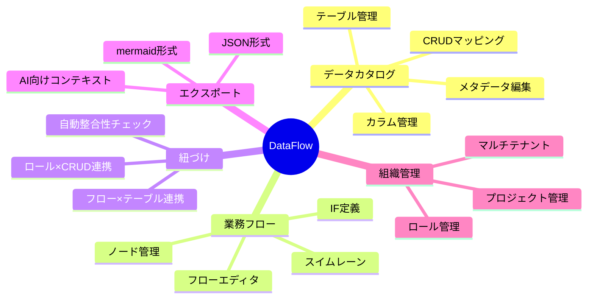

# 要件定義書

## 1. プロダクト概要

### 1.1 プロダクト名
**DataFlow** - データカタログ × 業務フロー統合プラットフォーム

### 1.2 プロダクトビジョン
データカタログと業務フローを紐づけることで、システムの全体像を人間とAIの両方が即座に理解できる世界を実現する。

### 1.3 解決する課題

| 課題 | 現状 | DataFlowによる解決 |
|------|------|-------------------|
| システム理解の困難さ | ドキュメントが散在、最新化されない | 一元管理、業務フローと連動 |
| AIエージェントの活用障壁 | コンテキスト不足で的外れな提案 | 構造化されたメタデータ提供 |
| 業務フローとDB設計の乖離 | 別々に管理され整合性なし | 業務フローからテーブル設計へ直結 |
| SQLクエリ作成の属人化 | スキーマ理解に時間がかかる | 自然言語→SQL変換の基盤提供 |

---

## 2. ターゲットユーザー

### 2.1 ペルソナ

#### ペルソナ1: エンジニア（田中さん）
- **役割**: バックエンドエンジニア
- **課題**: 新規参画時のキャッチアップに時間がかかる。AIコーディングツールに正確なコンテキストを渡したい
- **利用シーン**: 開発時にAIエージェントと連携、システム全体像の把握
- **期待する価値**: 開発速度向上、正確なAI提案

#### ペルソナ2: マーケター（佐藤さん）
- **役割**: データアナリスト / マーケター
- **課題**: SQLが書けない、どのテーブルにどのデータがあるか分からない
- **利用シーン**: 分析用データの抽出、レポート作成
- **期待する価値**: 自然言語でSQLクエリ生成、データへの迅速なアクセス

#### ペルソナ3: プロジェクトマネージャー（山田さん）
- **役割**: PM / ビジネスアナリスト
- **課題**: 業務フローの整理が属人的、顧客との認識合わせに時間がかかる
- **利用シーン**: 要件定義、顧客とのすり合わせ
- **期待する価値**: 業務フローの可視化、抜け漏れ防止

#### ペルソナ4: AIエージェント
- **役割**: 開発支援AI
- **課題**: システムコンテキストの不足
- **利用シーン**: コード生成、テスト計画作成、データ取得
- **期待する価値**: 構造化されたシステム情報へのアクセス

---

## 3. 機能要件

### 3.1 機能一覧

### 3.2 データカタログ機能

| ID | 機能名 | 説明 | 優先度 |
|----|--------|------|--------|
| DC-001 | テーブル作成 | テーブル名、説明、タグを登録 | Must |
| DC-002 | カラム作成 | カラム名、型、説明、制約を登録 | Must |
| DC-003 | メタデータ編集 | テーブル/カラムの詳細情報を編集 | Must |
| DC-004 | CRUDマッピング | カラムごとにCRUD操作とロールを紐づけ | Must |
| DC-005 | 検索・フィルタ | テーブル/カラムを検索、タグでフィルタ | Should |
| DC-006 | DBスキーマインポート | 既存DBからスキーマを自動取得 | Could |
| DC-007 | バージョン管理 | スキーマ変更履歴の管理 | Could |

### 3.3 業務フローエディタ機能

| ID | 機能名 | 説明 | 優先度 |
|----|--------|------|--------|
| BF-001 | フロー作成 | 新規業務フローを作成 | Must |
| BF-002 | ノード追加 | 処理/分岐/開始/終了ノードを追加 | Must |
| BF-003 | エッジ接続 | ノード間を矢印で接続 | Must |
| BF-004 | スイムレーン | ロール別のレーン表示 | Must |
| BF-005 | ノード詳細設定 | ノードにCRUD操作を紐づけ | Must |
| BF-006 | IF定義 | エッジにインターフェース情報を設定 | Should |
| BF-007 | ズーム/パン | キャンバスの拡大縮小・移動 | Must |
| BF-008 | 自動レイアウト | ノードを自動整列 | Could |

### 3.4 紐づけ・連携機能

| ID | 機能名 | 説明 | 優先度 |
|----|--------|------|--------|
| LK-001 | ノード×テーブル紐づけ | フローノードとテーブルを関連付け | Must |
| LK-002 | CRUD操作登録 | ノードでのCRUD操作を定義 | Must |
| LK-003 | 整合性チェック | フローとカタログの矛盾を検出 | Should |
| LK-004 | 影響範囲分析 | テーブル変更時の影響フローを表示 | Could |

### 3.5 エクスポート機能

| ID | 機能名 | 説明 | 優先度 |
|----|--------|------|--------|
| EX-001 | mermaid出力 | フローをmermaid記法で出力 | Must |
| EX-002 | JSON出力 | 全データを構造化JSONで出力 | Must |
| EX-003 | AI向けコンテキスト | AIエージェント用に最適化した出力 | Should |
| EX-004 | ER図出力 | テーブル関係をER図で出力 | Could |

### 3.6 組織・認証機能

| ID | 機能名 | 説明 | 優先度 |
|----|--------|------|--------|
| ORG-001 | ユーザー登録 | メール/パスワードで登録 | Must |
| ORG-002 | ログイン | メール/パスワードでログイン | Must |
| ORG-003 | 組織作成 | 新規組織（テナント）を作成 | Must |
| ORG-004 | プロジェクト作成 | 組織内にプロジェクトを作成 | Must |
| ORG-005 | メンバー招待 | 組織にメンバーを招待 | Should |
| ORG-006 | 権限管理 | 閲覧/編集/管理者権限 | Should |
| ORG-007 | OAuth連携 | Google/GitHubでログイン | Could |

---

## 4. 非機能要件

### 4.1 パフォーマンス

| 項目 | 要件 |
|------|------|
| ページ読み込み | 3秒以内（初回）、1秒以内（キャッシュ時） |
| API応答時間 | 500ms以内（95パーセンタイル） |
| 同時接続数 | 100ユーザー（MVP時点） |
| フローノード数 | 1フローあたり最大500ノード |

### 4.2 可用性

| 項目 | 要件 |
|------|------|
| 稼働率 | 99.5%（MVP時点） |
| バックアップ | 日次自動バックアップ |
| 障害復旧 | 4時間以内 |

### 4.3 セキュリティ

| 項目 | 要件 |
|------|------|
| 認証 | JWT + リフレッシュトークン |
| 通信 | HTTPS必須 |
| データ分離 | テナント間のデータ完全分離 |
| パスワード | bcryptハッシュ化 |

### 4.4 拡張性

| 項目 | 要件 |
|------|------|
| マルチテナント | 組織単位でのデータ分離 |
| API | RESTful、将来的にGraphQL検討 |
| プラグイン | 将来的にカスタムノードタイプ追加可能 |

---

## 5. 制約事項

### 5.1 技術的制約
- フロントエンド: Next.js 14（App Router）
- バックエンド: NestJS（Docker）
- データベース: PostgreSQL
- 初期はセルフホストまたはVercel + Render想定

### 5.2 ビジネス的制約
- MVP開発期間: 2ヶ月
- 初期ユーザー: 社内利用 + βテスター

---

## 6. 用語定義

| 用語 | 定義 |
|------|------|
| テナント | サービスを利用する組織単位 |
| プロジェクト | テナント内のシステム/プロダクト単位 |
| ロール | 業務を担当する主体。種別: 人/システム/その他 |
| ノード | 業務フロー上の処理単位 |
| エッジ | ノード間の接続（矢印） |
| CRUDマッピング | カラムに対するCreate/Read/Update/Delete操作の定義 |
| IF定義 | ロール間のデータ受け渡し仕様 |
| スイムレーン | ロール別に区切られたフロー図のレーン |

