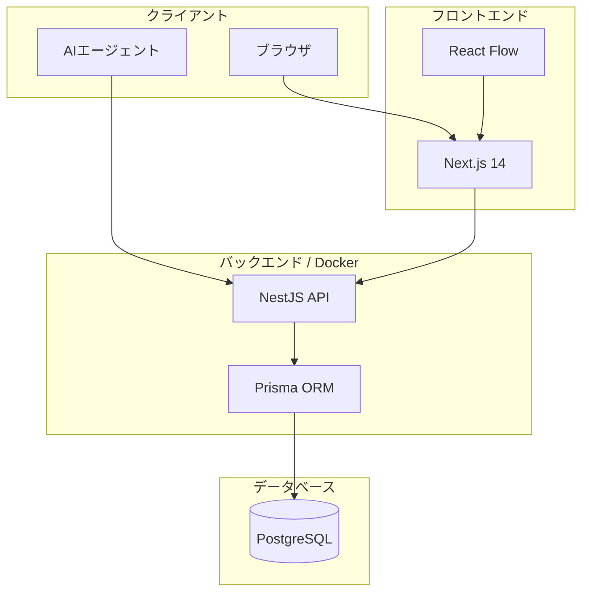
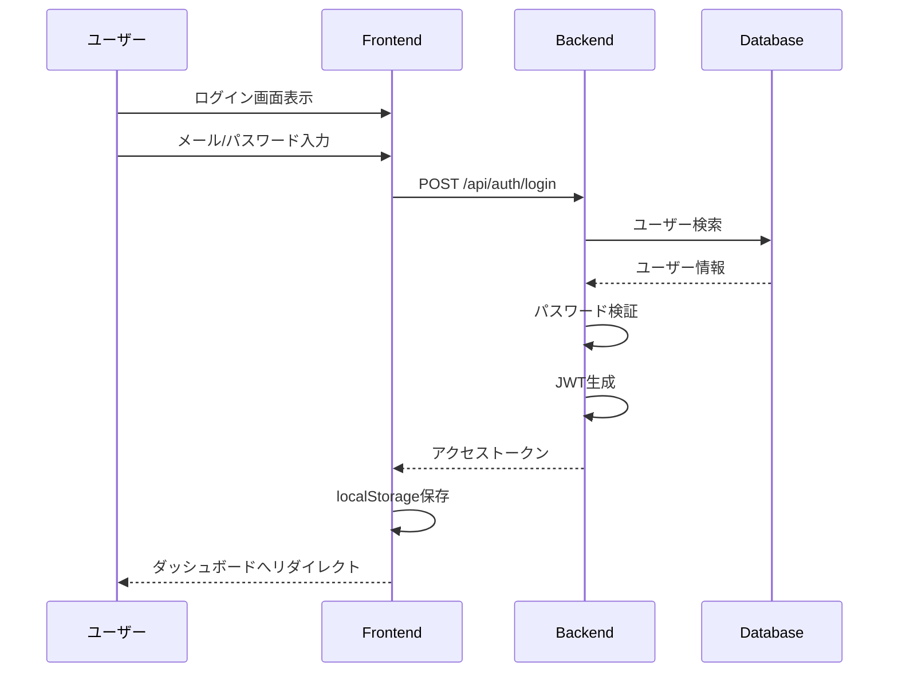
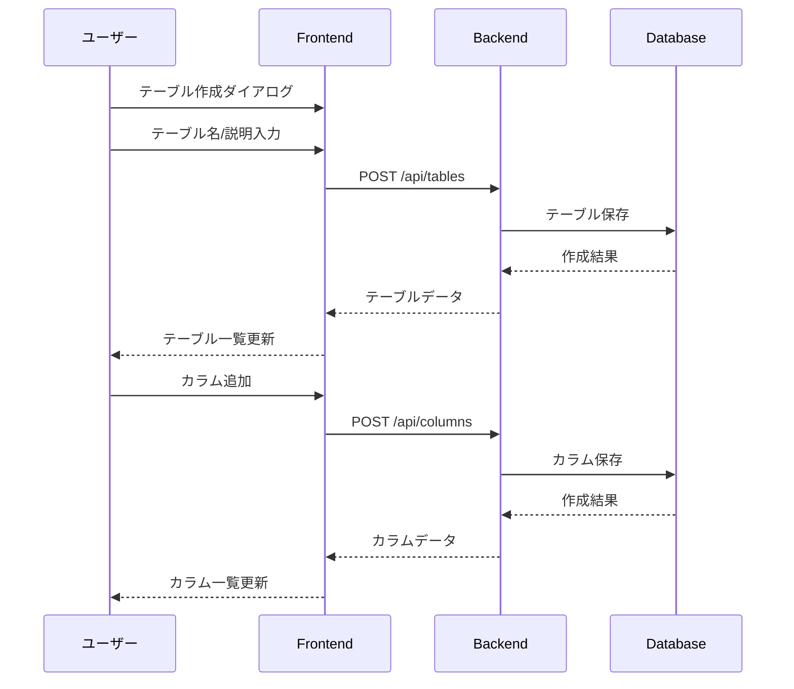
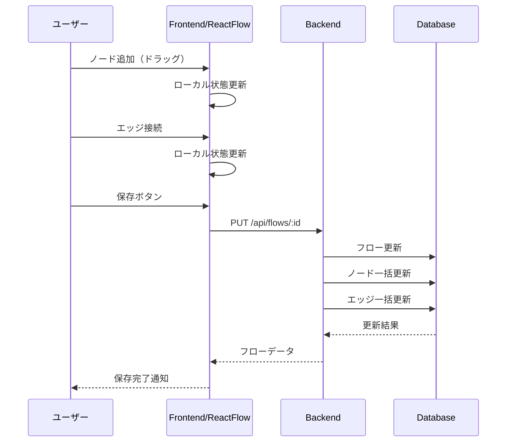

# アーキテクチャ設計書

## 1. システム構成図



## 2. 技術スタック詳細

### 2.1 フロントエンド

| 技術 | バージョン | 用途 |
|------|-----------|------|
| Next.js | 14.x | フレームワーク（App Router） |
| React | 18.x | UIライブラリ |
| TypeScript | 5.x | 型安全な開発 |
| Tailwind CSS | 3.x | スタイリング |
| shadcn/ui | - | UIコンポーネント |
| React Flow | 12.x | フローエディタ |
| TanStack Query | 5.x | サーバー状態管理 |
| Zustand | 4.x | クライアント状態管理 |
| NextAuth.js | 4.x | 認証 |

### 2.2 バックエンド

| 技術 | バージョン | 用途 |
|------|-----------|------|
| NestJS | 10.x | APIフレームワーク |
| TypeScript | 5.x | 型安全な開発 |
| Prisma | 5.x | ORM |
| PostgreSQL | 16.x | データベース |
| Passport | 0.7.x | 認証ミドルウェア |
| JWT | - | トークンベース認証 |
| Swagger | 7.x | API ドキュメント |

### 2.3 インフラ

| 技術 | 用途 |
|------|------|
| Docker | コンテナ化 |
| Docker Compose | 開発環境オーケストレーション |
| pnpm | パッケージマネージャー |

## 3. ディレクトリ構造

```
ai_data_flow/
├── docs/                           # 設計書
│   ├── README.md
│   ├── 01-requirements.md
│   ├── 02-architecture.md          # このファイル
│   ├── 03-data-model.md
│   ├── 04-api-spec.md
│   ├── 05-screen-design.md
│   └── 06-business-flow.md
│
├── frontend/                       # Next.js フロントエンド
│   ├── src/
│   │   ├── app/                    # App Router ページ
│   │   │   ├── (auth)/             # 認証関連ページ
│   │   │   ├── (dashboard)/        # ダッシュボード
│   │   │   ├── globals.css
│   │   │   ├── layout.tsx
│   │   │   └── page.tsx
│   │   ├── components/
│   │   │   ├── flow-editor/        # フローエディタ
│   │   │   │   ├── flow-editor.tsx
│   │   │   │   ├── nodes/          # カスタムノード
│   │   │   │   └── index.ts
│   │   │   ├── ui/                 # shadcn/ui コンポーネント
│   │   │   └── providers.tsx
│   │   └── lib/
│   │       ├── api.ts              # API クライアント
│   │       └── utils.ts
│   ├── package.json
│   ├── next.config.js
│   ├── tailwind.config.ts
│   └── tsconfig.json
│
├── backend/                        # NestJS バックエンド
│   ├── src/
│   │   ├── modules/
│   │   │   ├── auth/               # 認証
│   │   │   ├── organizations/      # 組織管理
│   │   │   ├── projects/           # プロジェクト
│   │   │   ├── roles/              # ロール
│   │   │   ├── tables/             # テーブル/カラム
│   │   │   ├── flows/              # 業務フロー
│   │   │   └── export/             # エクスポート
│   │   ├── prisma/
│   │   │   ├── prisma.module.ts
│   │   │   └── prisma.service.ts
│   │   ├── app.module.ts
│   │   └── main.ts
│   ├── prisma/
│   │   └── schema.prisma
│   ├── Dockerfile
│   ├── docker-compose.yml
│   ├── package.json
│   └── tsconfig.json
│
├── shared/                         # 共有型定義
│   └── src/
│       ├── types/
│       │   ├── entities.ts
│       │   ├── api.ts
│       │   └── index.ts
│       └── index.ts
│
├── package.json                    # ルート（ワークスペース）
├── pnpm-workspace.yaml
└── .gitignore
```

## 4. 認証フロー



## 5. データフロー

### 5.1 データカタログ作成フロー



### 5.2 業務フロー作成



## 6. API設計原則

### 6.1 RESTful設計

- リソース指向のURL設計
- HTTPメソッドの適切な使用
- ステータスコードの正しい返却

### 6.2 認証・認可

- JWTベースの認証
- Bearer トークンでのAPI保護
- 組織・プロジェクトレベルでのアクセス制御

### 6.3 エラーハンドリング

```typescript
{
  "success": false,
  "error": {
    "code": "VALIDATION_ERROR",
    "message": "入力値が不正です",
    "details": {
      "email": "有効なメールアドレスを入力してください"
    }
  }
}
```

## 7. デプロイ構成

### 7.1 開発環境

```
┌─────────────────────────────────────────┐
│            Docker Compose               │
│  ┌─────────────┐  ┌─────────────────┐  │
│  │  PostgreSQL │  │  NestJS Backend │  │
│  │   :5432     │  │     :3001       │  │
│  └─────────────┘  └─────────────────┘  │
└─────────────────────────────────────────┘
         ↑
┌─────────────────┐
│  Next.js Dev    │
│    :3000        │
└─────────────────┘
```

### 7.2 本番環境（想定）

```
┌──────────────────────────────────────────────────┐
│                    Vercel                         │
│  ┌────────────────────────────────────────────┐  │
│  │            Next.js Frontend                │  │
│  └────────────────────────────────────────────┘  │
└──────────────────────────────────────────────────┘
                        ↓
┌──────────────────────────────────────────────────┐
│                  Render / Railway                 │
│  ┌─────────────────┐  ┌───────────────────────┐  │
│  │  NestJS API     │  │  PostgreSQL           │  │
│  │  (Container)    │  │  (Managed)            │  │
│  └─────────────────┘  └───────────────────────┘  │
└──────────────────────────────────────────────────┘
```

## 8. セキュリティ考慮事項

### 8.1 認証・認可

- パスワードはbcryptでハッシュ化
- JWTの有効期限設定
- リフレッシュトークンによるセッション延長

### 8.2 データ保護

- HTTPS通信必須
- マルチテナントのデータ分離
- SQLインジェクション対策（Prisma ORM）

### 8.3 API保護

- Rate Limiting
- CORS設定
- 入力バリデーション（class-validator）

