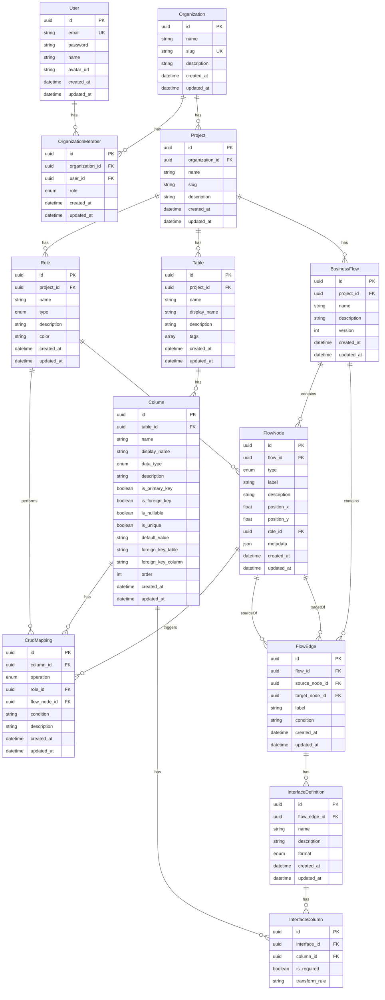

# データモデル設計書

## 1. ER図



## 2. テーブル定義

### 2.1 users（ユーザー）

| カラム名 | 型 | NULL | デフォルト | 説明 |
|---------|-----|------|-----------|------|
| id | UUID | NO | gen_random_uuid() | 主キー |
| email | VARCHAR(255) | NO | - | メールアドレス（ユニーク） |
| password | VARCHAR(255) | NO | - | bcryptハッシュ化パスワード |
| name | VARCHAR(255) | YES | NULL | 表示名 |
| avatar_url | VARCHAR(500) | YES | NULL | アバター画像URL |
| created_at | TIMESTAMP | NO | now() | 作成日時 |
| updated_at | TIMESTAMP | NO | now() | 更新日時 |

### 2.2 organizations（組織）

| カラム名 | 型 | NULL | デフォルト | 説明 |
|---------|-----|------|-----------|------|
| id | UUID | NO | gen_random_uuid() | 主キー |
| name | VARCHAR(255) | NO | - | 組織名 |
| slug | VARCHAR(100) | NO | - | URL用スラッグ（ユニーク） |
| description | TEXT | YES | NULL | 説明 |
| created_at | TIMESTAMP | NO | now() | 作成日時 |
| updated_at | TIMESTAMP | NO | now() | 更新日時 |

### 2.3 organization_members（組織メンバー）

| カラム名 | 型 | NULL | デフォルト | 説明 |
|---------|-----|------|-----------|------|
| id | UUID | NO | gen_random_uuid() | 主キー |
| organization_id | UUID | NO | - | 組織ID（FK） |
| user_id | UUID | NO | - | ユーザーID（FK） |
| role | ENUM | NO | MEMBER | 権限（OWNER/ADMIN/MEMBER/VIEWER） |
| created_at | TIMESTAMP | NO | now() | 作成日時 |
| updated_at | TIMESTAMP | NO | now() | 更新日時 |

**制約**: (organization_id, user_id) でユニーク

### 2.4 projects（プロジェクト）

| カラム名 | 型 | NULL | デフォルト | 説明 |
|---------|-----|------|-----------|------|
| id | UUID | NO | gen_random_uuid() | 主キー |
| organization_id | UUID | NO | - | 組織ID（FK） |
| name | VARCHAR(255) | NO | - | プロジェクト名 |
| slug | VARCHAR(100) | NO | - | URL用スラッグ |
| description | TEXT | YES | NULL | 説明 |
| created_at | TIMESTAMP | NO | now() | 作成日時 |
| updated_at | TIMESTAMP | NO | now() | 更新日時 |

**制約**: (organization_id, slug) でユニーク

### 2.5 roles（ロール）

| カラム名 | 型 | NULL | デフォルト | 説明 |
|---------|-----|------|-----------|------|
| id | UUID | NO | gen_random_uuid() | 主キー |
| project_id | UUID | NO | - | プロジェクトID（FK） |
| name | VARCHAR(100) | NO | - | ロール名 |
| type | ENUM | NO | HUMAN | 種別（HUMAN/SYSTEM/OTHER） |
| description | TEXT | YES | NULL | 説明 |
| color | VARCHAR(7) | YES | NULL | 表示色（HEX） |
| created_at | TIMESTAMP | NO | now() | 作成日時 |
| updated_at | TIMESTAMP | NO | now() | 更新日時 |

**制約**: (project_id, name) でユニーク

### 2.6 tables（テーブル）

| カラム名 | 型 | NULL | デフォルト | 説明 |
|---------|-----|------|-----------|------|
| id | UUID | NO | gen_random_uuid() | 主キー |
| project_id | UUID | NO | - | プロジェクトID（FK） |
| name | VARCHAR(100) | NO | - | テーブル名（物理名） |
| display_name | VARCHAR(255) | YES | NULL | 表示名 |
| description | TEXT | YES | NULL | 説明 |
| tags | VARCHAR[] | NO | '{}' | タグ配列 |
| created_at | TIMESTAMP | NO | now() | 作成日時 |
| updated_at | TIMESTAMP | NO | now() | 更新日時 |

**制約**: (project_id, name) でユニーク

### 2.7 columns（カラム）

| カラム名 | 型 | NULL | デフォルト | 説明 |
|---------|-----|------|-----------|------|
| id | UUID | NO | gen_random_uuid() | 主キー |
| table_id | UUID | NO | - | テーブルID（FK） |
| name | VARCHAR(100) | NO | - | カラム名（物理名） |
| display_name | VARCHAR(255) | YES | NULL | 表示名 |
| data_type | ENUM | NO | STRING | データ型 |
| description | TEXT | YES | NULL | 説明 |
| is_primary_key | BOOLEAN | NO | false | 主キーフラグ |
| is_foreign_key | BOOLEAN | NO | false | 外部キーフラグ |
| is_nullable | BOOLEAN | NO | true | NULL許可フラグ |
| is_unique | BOOLEAN | NO | false | ユニークフラグ |
| default_value | VARCHAR(255) | YES | NULL | デフォルト値 |
| foreign_key_table | VARCHAR(100) | YES | NULL | FK先テーブル |
| foreign_key_column | VARCHAR(100) | YES | NULL | FK先カラム |
| order | INTEGER | NO | 0 | 表示順 |
| created_at | TIMESTAMP | NO | now() | 作成日時 |
| updated_at | TIMESTAMP | NO | now() | 更新日時 |

**制約**: (table_id, name) でユニーク

### 2.8 business_flows（業務フロー）

| カラム名 | 型 | NULL | デフォルト | 説明 |
|---------|-----|------|-----------|------|
| id | UUID | NO | gen_random_uuid() | 主キー |
| project_id | UUID | NO | - | プロジェクトID（FK） |
| name | VARCHAR(255) | NO | - | フロー名 |
| description | TEXT | YES | NULL | 説明 |
| version | INTEGER | NO | 1 | バージョン番号 |
| created_at | TIMESTAMP | NO | now() | 作成日時 |
| updated_at | TIMESTAMP | NO | now() | 更新日時 |

### 2.9 flow_nodes（フローノード）

| カラム名 | 型 | NULL | デフォルト | 説明 |
|---------|-----|------|-----------|------|
| id | UUID | NO | gen_random_uuid() | 主キー |
| flow_id | UUID | NO | - | フローID（FK） |
| type | ENUM | NO | PROCESS | ノードタイプ |
| label | VARCHAR(255) | NO | - | ラベル |
| description | TEXT | YES | NULL | 説明 |
| position_x | FLOAT | NO | - | X座標 |
| position_y | FLOAT | NO | - | Y座標 |
| role_id | UUID | YES | NULL | 担当ロールID（FK） |
| metadata | JSONB | NO | '{}' | メタデータ |
| created_at | TIMESTAMP | NO | now() | 作成日時 |
| updated_at | TIMESTAMP | NO | now() | 更新日時 |

**FlowNodeType**: START, END, PROCESS, DECISION, SYSTEM_INTEGRATION, MANUAL_OPERATION, DATA_STORE

### 2.10 flow_edges（フローエッジ）

| カラム名 | 型 | NULL | デフォルト | 説明 |
|---------|-----|------|-----------|------|
| id | UUID | NO | gen_random_uuid() | 主キー |
| flow_id | UUID | NO | - | フローID（FK） |
| source_node_id | UUID | NO | - | 接続元ノードID（FK） |
| target_node_id | UUID | NO | - | 接続先ノードID（FK） |
| label | VARCHAR(100) | YES | NULL | エッジラベル |
| condition | TEXT | YES | NULL | 分岐条件 |
| created_at | TIMESTAMP | NO | now() | 作成日時 |
| updated_at | TIMESTAMP | NO | now() | 更新日時 |

### 2.11 crud_mappings（CRUDマッピング）

| カラム名 | 型 | NULL | デフォルト | 説明 |
|---------|-----|------|-----------|------|
| id | UUID | NO | gen_random_uuid() | 主キー |
| column_id | UUID | NO | - | カラムID（FK） |
| operation | ENUM | NO | - | 操作（CREATE/READ/UPDATE/DELETE） |
| role_id | UUID | NO | - | ロールID（FK） |
| flow_node_id | UUID | YES | NULL | フローノードID（FK） |
| condition | TEXT | YES | NULL | 実行条件 |
| description | TEXT | YES | NULL | 説明 |
| created_at | TIMESTAMP | NO | now() | 作成日時 |
| updated_at | TIMESTAMP | NO | now() | 更新日時 |

### 2.12 interface_definitions（IF定義）

| カラム名 | 型 | NULL | デフォルト | 説明 |
|---------|-----|------|-----------|------|
| id | UUID | NO | gen_random_uuid() | 主キー |
| flow_edge_id | UUID | NO | - | エッジID（FK） |
| name | VARCHAR(255) | NO | - | IF名 |
| description | TEXT | YES | NULL | 説明 |
| format | ENUM | NO | API | データ形式 |
| created_at | TIMESTAMP | NO | now() | 作成日時 |
| updated_at | TIMESTAMP | NO | now() | 更新日時 |

**InterfaceFormat**: API, CSV, SCREEN, FILE, DATABASE, OTHER

### 2.13 interface_columns（IFカラム）

| カラム名 | 型 | NULL | デフォルト | 説明 |
|---------|-----|------|-----------|------|
| id | UUID | NO | gen_random_uuid() | 主キー |
| interface_id | UUID | NO | - | IF定義ID（FK） |
| column_id | UUID | NO | - | カラムID（FK） |
| is_required | BOOLEAN | NO | false | 必須フラグ |
| transform_rule | TEXT | YES | NULL | 変換ルール |

**制約**: (interface_id, column_id) でユニーク

## 3. 列挙型定義

### MemberRole
```
OWNER   - 所有者（全権限）
ADMIN   - 管理者（メンバー管理可）
MEMBER  - メンバー（編集可）
VIEWER  - 閲覧者（閲覧のみ）
```

### RoleType
```
HUMAN   - 人（顧客、管理者など）
SYSTEM  - システム（外部API、バッチ処理など）
OTHER   - その他
```

### ColumnDataType
```
STRING    - 文字列
INTEGER   - 整数
FLOAT     - 浮動小数点
BOOLEAN   - 真偽値
DATE      - 日付
DATETIME  - 日時
JSON      - JSON
TEXT      - 長文テキスト
UUID      - UUID
```

### FlowNodeType
```
START               - 開始ノード
END                 - 終了ノード
PROCESS             - 処理ノード
DECISION            - 分岐ノード
SYSTEM_INTEGRATION  - システム連携ノード
MANUAL_OPERATION    - 手動操作ノード
DATA_STORE          - データストアノード
```

### CrudOperation
```
CREATE  - 作成
READ    - 読取
UPDATE  - 更新
DELETE  - 削除
```

### InterfaceFormat
```
API       - API
CSV       - CSV
SCREEN    - 画面
FILE      - ファイル
DATABASE  - データベース
OTHER     - その他
```

