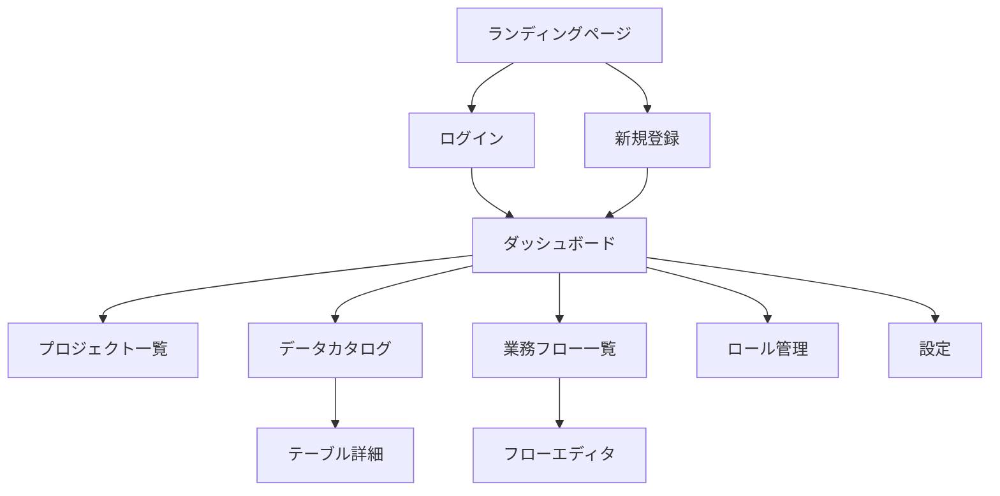

# 画面設計書

## 1. 画面一覧

| No. | 画面名 | パス | 説明 |
|-----|--------|------|------|
| 1 | ランディングページ | / | プロダクト紹介、CTA |
| 2 | ログイン | /login | 認証画面 |
| 3 | 新規登録 | /register | アカウント作成 |
| 4 | ダッシュボード | /dashboard | 概要表示 |
| 5 | プロジェクト一覧 | /dashboard/projects | プロジェクト管理 |
| 6 | データカタログ一覧 | /dashboard/catalog | テーブル一覧 |
| 7 | テーブル詳細 | /dashboard/catalog/:id | カラム・CRUDマッピング |
| 8 | 業務フロー一覧 | /dashboard/flows | フロー一覧 |
| 9 | フローエディタ | /dashboard/flows/:id | フロー編集 |
| 10 | ロール管理 | /dashboard/roles | ロール一覧・編集 |
| 11 | 設定 | /dashboard/settings | アカウント・組織設定 |

## 2. 画面遷移図



## 3. 画面詳細

### 3.1 ランディングページ (/)

```
┌─────────────────────────────────────────────────────────┐
│ [Logo] DataFlow                    [ログイン] [無料で始める] │
├─────────────────────────────────────────────────────────┤
│                                                         │
│              データカタログと                              │
│              業務フローを統合                              │
│                                                         │
│     システムの全体像をAIと人間の両方が即座に理解できる        │
│                                                         │
│         [無料で始める →]    [デモを見る]                   │
│                                                         │
├─────────────────────────────────────────────────────────┤
│  ┌─────────────┐  ┌─────────────┐  ┌─────────────┐     │
│  │ データカタログ │  │ 業務フロー    │  │ AI連携      │     │
│  │ テーブル管理   │  │ エディタ      │  │ コンテキスト │     │
│  └─────────────┘  └─────────────┘  └─────────────┘     │
└─────────────────────────────────────────────────────────┘
```

### 3.2 ログイン (/login)

```
┌─────────────────────────────────────────────────────────┐
│                                                         │
│                    [Logo] DataFlow                       │
│                                                         │
│            ┌─────────────────────────────┐              │
│            │        ログイン               │              │
│            │                             │              │
│            │  メールアドレス               │              │
│            │  ┌───────────────────────┐  │              │
│            │  │ you@example.com       │  │              │
│            │  └───────────────────────┘  │              │
│            │                             │              │
│            │  パスワード                  │              │
│            │  ┌───────────────────────┐  │              │
│            │  │ ••••••••              │  │              │
│            │  └───────────────────────┘  │              │
│            │                             │              │
│            │  ┌───────────────────────┐  │              │
│            │  │      ログイン          │  │              │
│            │  └───────────────────────┘  │              │
│            │                             │              │
│            │  アカウントをお持ちでない方は  │              │
│            │  新規登録                   │              │
│            └─────────────────────────────┘              │
│                                                         │
└─────────────────────────────────────────────────────────┘
```

### 3.3 ダッシュボード (/dashboard)

```
┌──────────┬──────────────────────────────────────────────┐
│          │  ダッシュボード           [+ 新規プロジェクト]   │
│  [Logo]  ├──────────────────────────────────────────────┤
│          │                                              │
│ ─────────│  ┌──────────┐  ┌──────────┐  ┌──────────┐   │
│ Dashboard│  │テーブル数  │  │業務フロー  │  │ロール     │   │
│ Projects │  │    15    │  │    8     │  │    5     │   │
│ Catalog  │  └──────────┘  └──────────┘  └──────────┘   │
│ Flows    │                                              │
│ Roles    │  クイックスタート                              │
│ Settings │  ┌─────────────────────────────────────────┐ │
│          │  │ 📊 テーブルを追加                        │ │
│ ─────────│  │ 🔀 業務フローを作成                      │ │
│ Logout   │  │ 👥 ロールを定義                         │ │
│          │  └─────────────────────────────────────────┘ │
└──────────┴──────────────────────────────────────────────┘
```

### 3.4 データカタログ一覧 (/dashboard/catalog)

```
┌──────────┬──────────────────────────────────────────────┐
│          │  データカタログ              [+ テーブル追加]   │
│  [Logo]  ├──────────────────────────────────────────────┤
│          │  🔍 テーブルを検索...                         │
│ ─────────│                                              │
│ Dashboard│  ┌─────────────┐  ┌─────────────┐            │
│ Projects │  │ 📊 users    │  │ 📊 orders   │            │
│ Catalog ←│  │ ユーザー    │  │ 注文        │            │
│ Flows    │  │ 8 カラム    │  │ 12 カラム   │            │
│ Roles    │  │ [master]    │  │ [transaction]│           │
│ Settings │  └─────────────┘  └─────────────┘            │
│          │                                              │
│ ─────────│  ┌─────────────┐                            │
│ Logout   │  │ 📊 products │                            │
│          │  │ 商品        │                            │
│          │  │ 15 カラム   │                            │
│          │  │ [master][ec]│                            │
│          │  └─────────────┘                            │
└──────────┴──────────────────────────────────────────────┘
```

### 3.5 テーブル詳細 (/dashboard/catalog/:id)

```
┌──────────┬──────────────────────────────────────────────┐
│          │  ← users（ユーザー）              [編集]      │
│  [Logo]  ├──────────────────────────────────────────────┤
│          │  ユーザーアカウント情報を管理するテーブル        │
│ ─────────│  [master] [auth]                             │
│ Dashboard│                                              │
│ Projects │  [カラム一覧]  [CRUDマッピング]                 │
│ Catalog ←│  ────────────────────────────────────────    │
│ Flows    │                               [+ カラム追加]  │
│ Roles    │  ┌─────────────────────────────────────────┐ │
│ Settings │  │ カラム名   │ 表示名   │ 型    │ 制約    │ │
│          │  ├───────────┼─────────┼───────┼─────────┤ │
│ ─────────│  │ id        │ ID      │ UUID  │ PK      │ │
│ Logout   │  │ email     │ メール   │STRING │ UK,NN   │ │
│          │  │ name      │ 名前    │STRING │         │ │
│          │  │ org_id    │ 組織ID  │ UUID  │ FK,NN   │ │
│          │  └─────────────────────────────────────────┘ │
└──────────┴──────────────────────────────────────────────┘
```

### 3.6 フローエディタ (/dashboard/flows/:id)

```
┌──────────┬──────────────────────────────────────────────┐
│          │  ← 注文処理フロー    [mermaid出力] [保存]     │
│  [Logo]  ├──────────────────────────────────────────────┤
│          │  ツールバー: [□ 処理] [◇ 分岐] [⬡ DB] [● 終了] │
│ ─────────├──────────────────────────────────────────────┤
│ Dashboard│  │    顧客    │   システム   │   管理者   │  │
│ Projects │  ├────────────┼─────────────┼────────────┤  │
│ Catalog  │  │            │             │            │  │
│ Flows   ←│  │   (開始)   │             │            │  │
│ Roles    │  │     │      │             │            │  │
│ Settings │  │     ↓      │             │            │  │
│          │  │ [商品選択] │             │            │  │
│ ─────────│  │     │      │             │            │  │
│ Logout   │  │     ↓      │             │            │  │
│          │  │ [カート追加]─────→[在庫確認]│            │  │
│          │  │            │     │      │            │  │
│          │  │            │     ↓      │            │  │
│          │  │            │  ◇判断◇    │            │  │
│          │  │            │  /    \    │            │  │
│          │  │            │Yes    No   │            │  │
└──────────┴──────────────────────────────────────────────┘
```

### 3.7 ロール管理 (/dashboard/roles)

```
┌──────────┬──────────────────────────────────────────────┐
│          │  ロール管理                  [+ ロール追加]   │
│  [Logo]  ├──────────────────────────────────────────────┤
│          │                                              │
│ ─────────│  ┌─────────────┐  ┌─────────────┐            │
│ Dashboard│  │ 👤 顧客     │  │ 👤 管理者   │            │
│ Projects │  │ 人          │  │ 人          │            │
│ Catalog  │  │ ECサイト利用者│  │ バックオフィス│           │
│ Flows    │  │ ● #3B82F6  │  │ ● #8B5CF6  │            │
│ Roles   ←│  │ 15フローで使用│  │ 8フローで使用 │           │
│ Settings │  └─────────────┘  └─────────────┘            │
│          │                                              │
│ ─────────│  ┌─────────────┐  ┌─────────────┐            │
│ Logout   │  │ 🖥️ 決済     │  │ 🖥️ 在庫管理 │            │
│          │  │ システム    │  │ システム    │            │
│          │  │ Stripe連携  │  │ 倉庫システム │            │
│          │  │ ● #10B981  │  │ ● #F59E0B  │            │
│          │  └─────────────┘  └─────────────┘            │
└──────────┴──────────────────────────────────────────────┘
```

## 4. コンポーネント構成

### 4.1 共通コンポーネント

| コンポーネント | 説明 |
|--------------|------|
| Button | ボタン（variant: default/outline/ghost/destructive） |
| Input | テキスト入力 |
| Label | フォームラベル |
| Card | カードコンテナ |
| Dialog | モーダルダイアログ |
| Select | セレクトボックス |
| Tabs | タブ切り替え |
| Toast | 通知トースト |

### 4.2 レイアウトコンポーネント

| コンポーネント | 説明 |
|--------------|------|
| DashboardLayout | サイドバー＋メインコンテンツ |
| AuthLayout | 認証画面用レイアウト |
| Sidebar | サイドナビゲーション |

### 4.3 機能コンポーネント

| コンポーネント | 説明 |
|--------------|------|
| FlowEditor | React Flowベースのフローエディタ |
| ProcessNode | 処理ノード |
| DecisionNode | 分岐ノード |
| DataStoreNode | データストアノード |
| StartEndNode | 開始/終了ノード |

## 5. デザインシステム

### 5.1 カラーパレット

| 用途 | Light | Dark |
|------|-------|------|
| Background | #FFFFFF | #0F172A |
| Foreground | #0F172A | #F8FAFC |
| Primary | #3B82F6 | #60A5FA |
| Secondary | #F1F5F9 | #1E293B |
| Muted | #F1F5F9 | #1E293B |
| Accent | #F1F5F9 | #1E293B |
| Destructive | #EF4444 | #F87171 |
| Border | #E2E8F0 | #1E293B |

### 5.2 タイポグラフィ

| 要素 | フォント | サイズ |
|------|---------|-------|
| H1 | Inter Bold | 36px |
| H2 | Inter SemiBold | 30px |
| H3 | Inter SemiBold | 24px |
| Body | Inter Regular | 14px |
| Small | Inter Regular | 12px |
| Code | JetBrains Mono | 14px |

### 5.3 間隔

| サイズ | 値 |
|-------|-----|
| xs | 4px |
| sm | 8px |
| md | 16px |
| lg | 24px |
| xl | 32px |
| 2xl | 48px |

