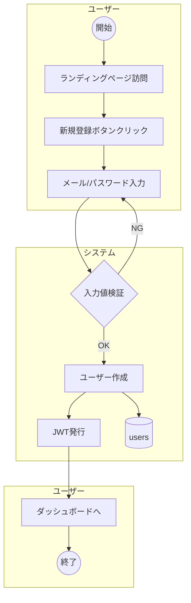
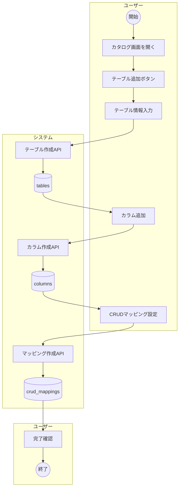
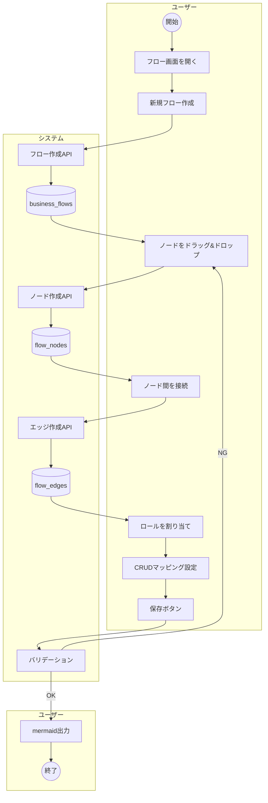
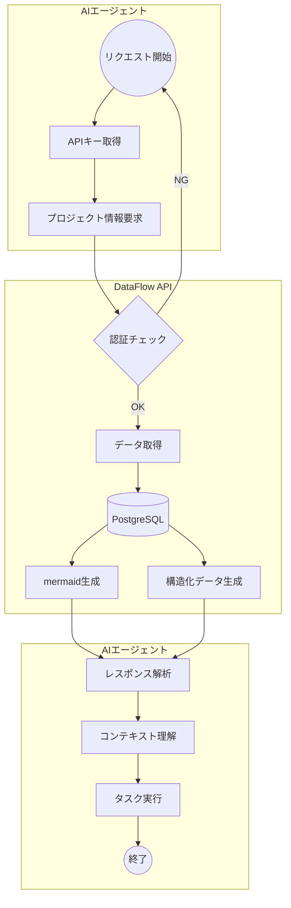
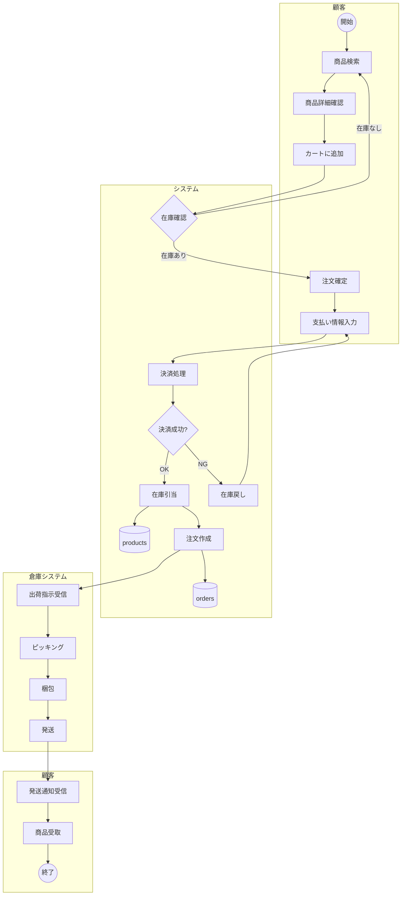
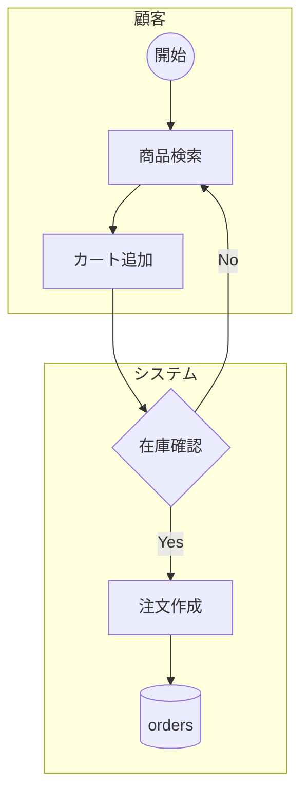

# 業務フロー図

## 1. ユーザー登録フロー

## 2. データカタログ作成フロー

## 3. 業務フロー作成フロー

## 4. AIエージェント連携フロー

## 5. 注文処理フロー（サンプル）

DataFlowで作成する業務フローの例として、ECサイトの注文処理フローを示します。

## 6. CRUDマッピング例

上記の注文処理フローにおける、ordersテーブルのCRUDマッピング：

| カラム | 操作 | ロール | フローノード | 条件 |
|-------|------|-------|------------|------|
| id | CREATE | システム | 注文作成 | 決済成功時 |
| customer_id | CREATE | システム | 注文作成 | ログインユーザーから |
| total_amount | CREATE | システム | 注文作成 | カート合計から |
| status | CREATE | システム | 注文作成 | 'pending'で初期化 |
| status | UPDATE | 倉庫システム | 発送 | 'shipped'に更新 |
| status | READ | 顧客 | 発送通知受信 | ステータス確認 |
| shipped_at | UPDATE | 倉庫システム | 発送 | 発送時刻記録 |

## 7. mermaidエクスポート形式

DataFlowから出力されるmermaid形式の例：

このmermaid形式は以下の用途で活用できます：

1. **AIエージェントへのコンテキスト提供**
   - システム全体像の理解
   - 適切なコード生成の支援
   
2. **ドキュメント生成**
   - 設計書への埋め込み
   - Wiki/Notionへの共有
   
3. **顧客との認識合わせ**
   - 業務フローの可視化
   - 要件確認

